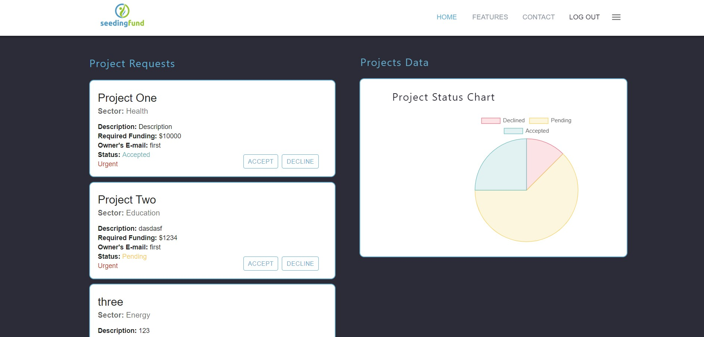
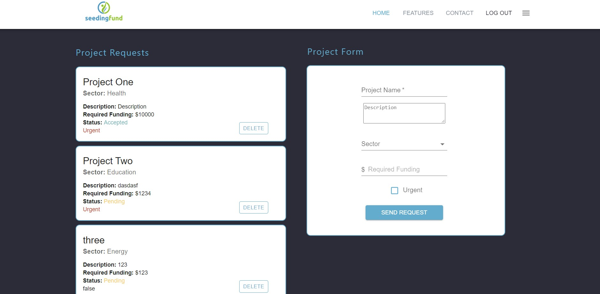

# Seeding Fund

This project is a web development assignment for InfoGraph

- **Author** : Yazan Tafesh

## Project description

* A company called “seedingfund” that funding projects and looking to create projects management system. Users will be able to register, login, send a funding request with their project details and check the status of the funding request of the project. Admins should login and see all funding requests.

[Deployment](https://seeding-fund.netlify.app/)   
[Backend repo](https://github.com/yazantafesh/seeding-fund-backend)   

## Main Features

- Authentication and Authorization
- ACL
- Cookies
- Create Project Requests
- Admin Page
- Project stats on admin page

## Resources and Technologies

* Built with React to communicate with a Node.js Express server, using mongoDB database in addition to pure CSS and Material-UI components.

- Front end

  - React
  - React-Cookies
  - Material-UI
  - chart.js
  - JWT

- Backend

  - Node.js
  - MongoDB
  - Express
  - Mongoose
  - JWT

## version 
1.0.0 Oct 2021 : Creation of the project

